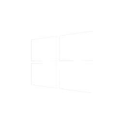

<p style="font-size:50px;text-align: center;color:hsl(204, 90%, 45%)"><b>Csound plugin opcodes</b></p>

This repoistory is a collection of various different opcodes that are bundled with [Cabbage](http://cabbageaudio.com). 

If you wish to try them out you with vanilla Csound you can do so by downloading the current release. 

<br>

<a href="../html-link.htm"></a><a href="../html-link.htm"></a><a href="../html-link.htm"></a>

<br>


To use any of the plugin opcodes you will need to tell Csound where they are located. You can do this in the `CsOptions` section of your Csound file. For example:

```csound
<CsOptions>
--opcode-lib=channelStateOpcodes.dll
</CsOptions>
```

## Contributing

This repository has a CI build that is triggered to compile opcodes on Linux, MacOS and Windows. If you have some opcodes that you would like to contribute to this collection, fork the repo, write your opcode and make a pull request. All of the plugin here use the [Csound Opcode-SDK](https://github.com/csound/opcode_sdk).  